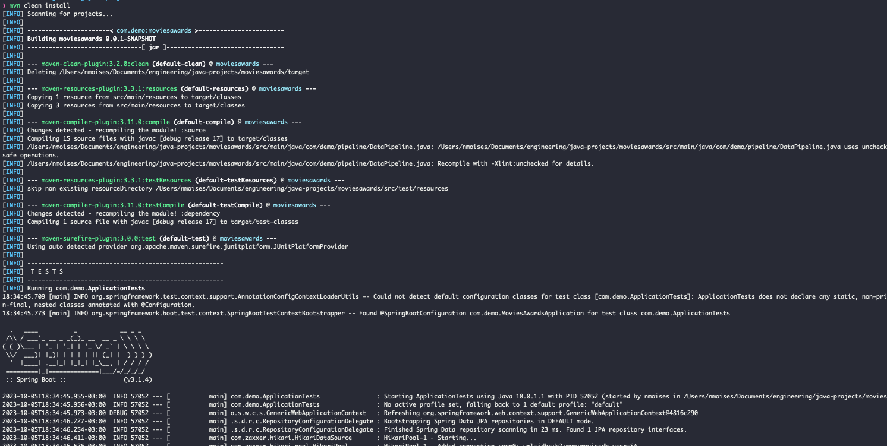
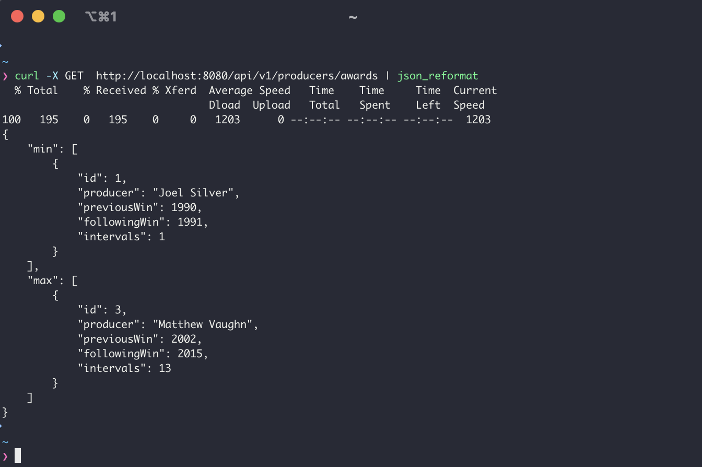

[](https://github.com/nmoisesp/apache-beam-etl-pipeline-demo/actions/workflows/ci-maven.yml)

# Apache Beam ETL Pipeline & Spring Boot Rest API Demo

USE CASE:

* Implemented an ETL pipeline to load a local CSV file (data source) into a H2 database (in memory)
* The CSV file is located in the resources directory for simplicity and demo purpose
* Implemented some Apache Beam PTransforms and business rules 
* Stored the raw and aggregated data into database
* Implemented a Spring Boot REST API to get the aggregated data

### Prerequisites to run this application:

* Java 17
* Maven 3.8


### Instructions:

Clone this repo and execute these commands from the root directory:

```shell
mvn clean install
```


```shell
mvn spring-boot:run
```


### REST API:
```shell
curl -X GET  http://localhost:8080/api/v1/producers | json_reformat
```


### H2 DATABASE:
[H2 Database Console URL](http://localhost:8080/h2)

```shell
user: sa
password: <empty>
```
Table representing the Raw Data (not normalized) for analytics purpose:


Table representing the aggregated data and calculated metrics (year of awards and their intervals):


### CSV File Layout:


### Keep in touch:
Nicholas Moises: 
[Linkedin profile](https://www.linkedin.com/in/nicholas-moises/)
